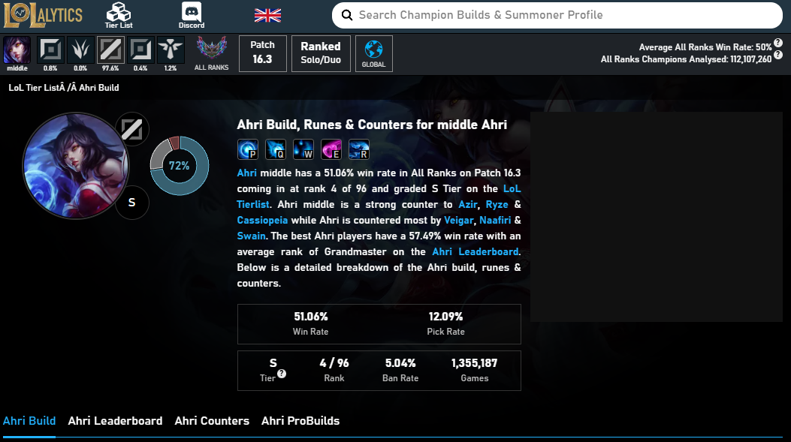
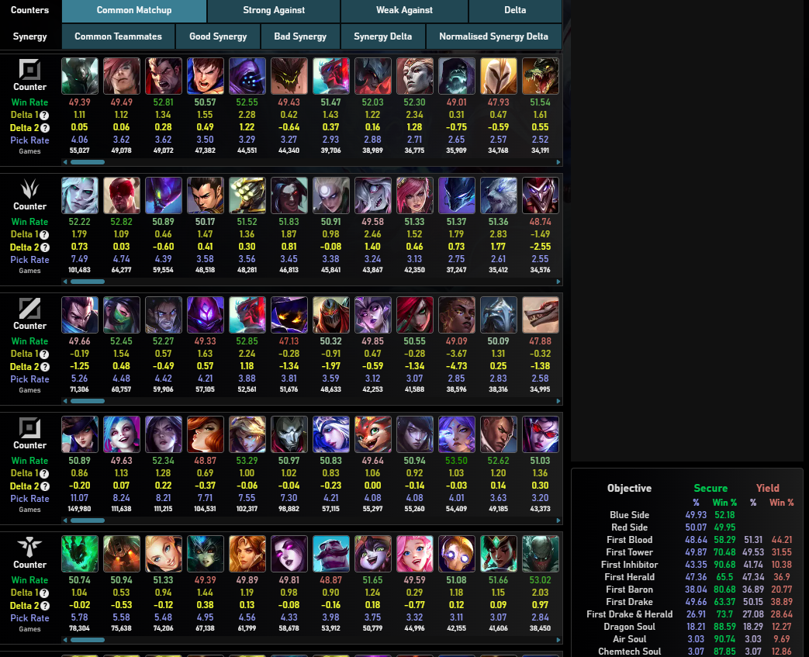
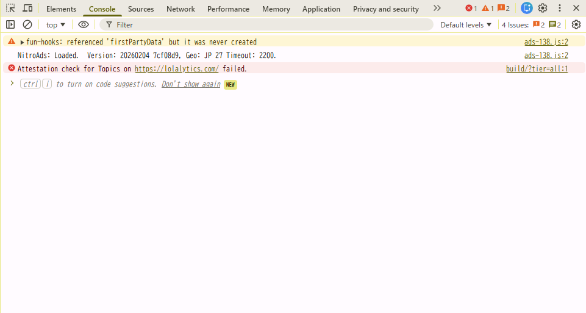
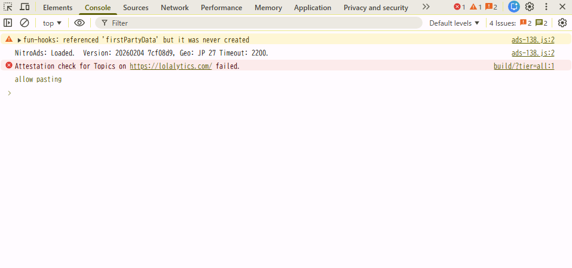
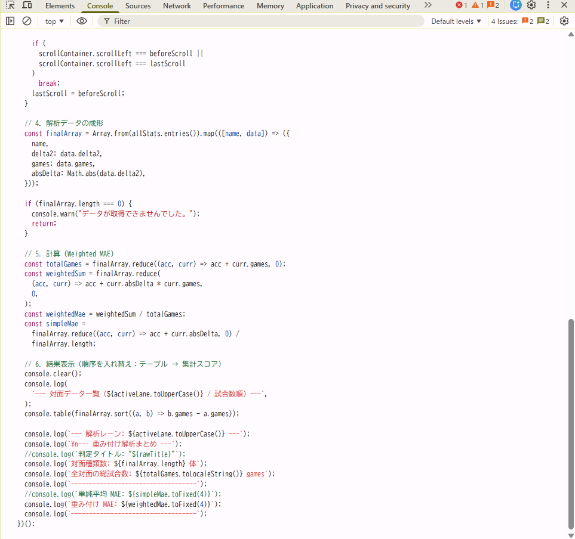
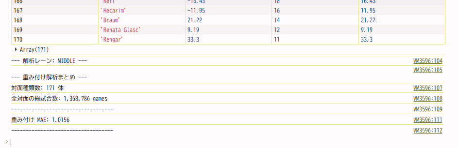

# 📖 Lolalytics 先出しチェッカー 利用ガイド

このドキュメントは、LolalyticsのCounterデータから、試合数による重み付けを行った**平均絶対誤差（MAE）**をDelta2の指標より算出・評価するためのガイドです。

---

本ツールは、[Lolalytics](https://lolalytics.com/) の統計データを活用し、リーグ・オブ・レジェンド（LoL）における**特定チャンピオンの「先出し性能（ブラインドピック適性）」を数値化**します。

解析手法の背景については、以下のサイトをご参照ください。  
👉 [LOL忍者：先出しの強さを測る指標MAEについて](https://lolninja.net/2026/02/15/49370/)

#### 📊 算出の仕組み

一般的なMAE（平均絶対誤差）は勝率と試合数から算出されますが、当プログラムでは Lolalytics 独自の指標である **「Delta2」** をベースに計算を行います。

- **Delta2とは？**: チャンピオンの平均勝率に対する「対面ごとの相性乖離」を示す値です。
- **重み付け解析**: 単なる平均ではなく、試合数（母数）に応じた重み付けを行うことで、データの信頼性を担保し、より実戦に近い「安定度」を算出します。

---

## 🛠 2. 実行手順

### Step 1: Lolalyticsで解析対象とするチャンピオンを開く

[Lolalytics](https://lolalytics.com/)



---

### Step 2: 解析対象のページで「Counter」が見える位置までスクロールをする



---

### Step 3: デベロッパーツール（コンソール）を起動

キーボードの **`F12`** キー（または `Ctrl + Shift + I`）を押して、**「Console」** タブを選択します。



大抵の場合、はじめから **Console** タブが開かれているかと思います。

---

### Step 3: コンソール内の貼り付け許可（初回のみ）

セキュリティ保護（Self-XSS対策）のために、初めてコンソールを利用する際にコピペが禁止されている場合があります。

貼り付けができない、または警告が表示された場合は、コンソールに **直接「allow pasting」と入力** して `Enter` を押してください。



---

### Step 4: コードを貼り付けて実行

以下のソースコードをコピーし、コンソールの入力欄に貼り付けて **`Enter`** を押してください。



```javascript
(async () => {
  // 1. タイトルからレーンを特定
  const rawTitle = document.title;
  const lanes = ["top", "middle", "jungle", "bottom", "support"];
  const activeLane = lanes.find((lane) =>
    rawTitle.toLowerCase().includes(lane),
  );

  if (!activeLane) {
    console.error("タイトルからレーンを判別できませんでした:", rawTitle);
    return;
  }

  // 2. 【改善】全コンテナから対象レーンのデータが入っている「正しい箱」を自動探索
  const allContainers = Array.from(document.querySelectorAll(".cursor-grab"));
  const scrollContainer = allContainers.find((c) => {
    // 箱の中にそのレーン(vslane=...)のリンクが含まれているかチェック
    return c.querySelector(`a[href*="vslane=${activeLane}"]`);
  });

  if (!scrollContainer) {
    console.error(
      `${activeLane.toUpperCase()} 用のデータコンテナが見つかりません。Matchupsタブを確認してください。`,
    );
    return;
  }

  console.log(
    `[START] "${activeLane.toUpperCase()}" レーンの解析を開始します...`,
  );

  let allStats = new Map();

  const fetchData = () => {
    const items = scrollContainer.querySelectorAll(":scope > div > div");
    items.forEach((el) => {
      const aTag = el.querySelector('a[href*="/vs/"]');
      if (!aTag || !aTag.getAttribute("href").includes(`vslane=${activeLane}`))
        return;

      const name = el.querySelector("img")?.alt;
      const divs = Array.from(
        el.querySelectorAll("div.my-1, div.text-\\[9px\\]"),
      );

      if (name && divs.length >= 5) {
        const delta2 = parseFloat(divs[2].innerText.replace(/,/g, ""));
        const games = parseInt(divs[4].innerText.replace(/,/g, ""));

        if (!isNaN(delta2) && !isNaN(games) && games > 0) {
          allStats.set(name, { delta2, games });
        }
      }
    });
  };

  // 3. スクロール実行
  let lastScroll = -1;
  while (true) {
    const beforeScroll = scrollContainer.scrollLeft;
    fetchData();
    scrollContainer.scrollLeft += 800;
    await new Promise((r) => setTimeout(r, 50));

    if (
      scrollContainer.scrollLeft === beforeScroll ||
      scrollContainer.scrollLeft === lastScroll
    )
      break;
    lastScroll = beforeScroll;
  }

  // 4. 解析データの成形
  const finalArray = Array.from(allStats.entries()).map(([name, data]) => ({
    name,
    delta2: data.delta2,
    games: data.games,
    absDelta: Math.abs(data.delta2),
  }));

  if (finalArray.length === 0) {
    console.warn("データが取得できませんでした。");
    return;
  }

  // 5. 計算 (Weighted MAE)
  const totalGames = finalArray.reduce((acc, curr) => acc + curr.games, 0);
  const weightedSum = finalArray.reduce(
    (acc, curr) => acc + curr.absDelta * curr.games,
    0,
  );
  const weightedMae = weightedSum / totalGames;
  const simpleMae =
    finalArray.reduce((acc, curr) => acc + curr.absDelta, 0) /
    finalArray.length;

  // 6. 結果表示（順序を入れ替え：テーブル → 集計スコア）
  console.clear();
  console.log(
    `--- 対面データ一覧 (${activeLane.toUpperCase()} / 試合数順) ---`,
  );
  console.table(finalArray.sort((a, b) => b.games - a.games));

  console.log(`--- 解析レーン: ${activeLane.toUpperCase()} ---`);
  console.log(`\n--- 重み付け解析まとめ ---`);
  //console.log(`判定タイトル: "${rawTitle}"`);
  console.log(`対面種類数: ${finalArray.length} 体`);
  console.log(`全対面の総試合数: ${totalGames.toLocaleString()} games`);
  console.log(`-----------------------------------`);
  //console.log(`単純平均 MAE: ${simpleMae.toFixed(4)}`);
  console.log(`重み付け MAE: ${weightedMae.toFixed(4)}`);
  console.log(`-----------------------------------`);
})();
```

---

### 解析結果の確認



#### 📊 データの読み方

**「重み付け MAE」の数値が低いほど、相手を選ばず安定して戦える（先出しがしやすい）** チャンピオンであることを示します。

> **⚠️ 注意事項**
> レーン（TOP、MID、JGなど）によって、全チャンピオンの平均的なMAE基準値は異なります。
> そのため、異なるレーン間での単純な数値比較には注意が必要です。

---

#### 🛠️ 現在アップデート中...

現在、各レーンごとの詳細な「評価基準」を作成中です。
より正確な先出し判断ができるよう、今後の更新をお待ちください！

---

```

```
